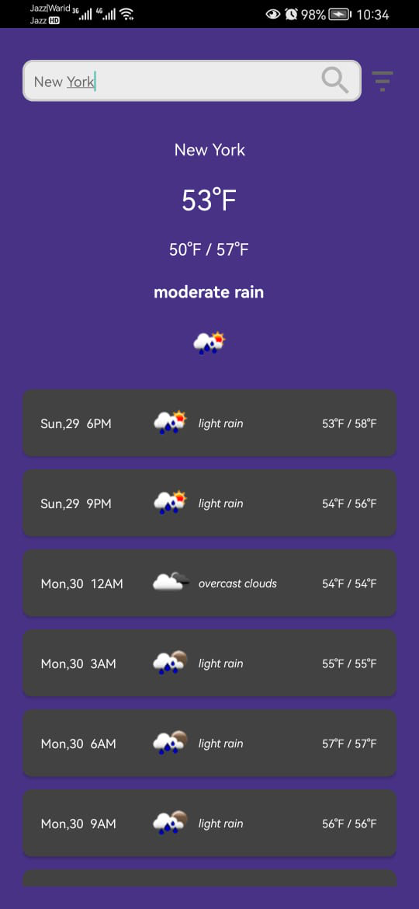

## TestWeatherAppWithHilt
- Overview

This is a weather application that provides real-time weather information based on a specified location. The application uses the OpenWeatherMap API to fetch weather data, and it is built with Android, utilizing Hilt for dependency injection, Coroutines for asynchronous programming and ViewModel for managing UI-related data.





## Features
Display the current weather information for a specific location.
Allows the user to search for weather information of any location.
View additional weather details such as seven days weather forecast and more.
User-friendly and intuitive interface.
Prerequisites
Before you begin, ensure you have met the following requirements:

- Android Studio: 
The application is developed using Android Studio, so you need to have it installed on your development machine.
- OpenWeatherMap API Key: 
You must obtain an API key from OpenWeatherMap to use their weather data and replace it in the code if current API key doesn't work.

## Installation
   Clone the repository to your local machine using Git:

  - git clone https://github.com/your-username/your-weather-app.git
  - Open the project in Android Studio.


## Updating the API Key

To update the API key used in this weather application, follow these steps:

1. Go to the [OpenWeatherMap](https://openweathermap.org) website and sign in to your account or create a new one if you don't have an account yet.

2. Once logged in, navigate to the API Keys section within your OpenWeatherMap account dashboard.

3. Generate a new API key if you don't already have one, or copy an existing API key.

4. Open the project in Android Studio.

5. Locate the `Constants` class within your source code. It should be in the `com.khawajatest.weathertestapp` package.

6. In the `Constants` class, find the `apiKey` constant and replace the existing key with your new OpenWeatherMap API key:

   ```kotlin
   class Constants {
       companion object {
           const val TAG = "TestWeatherApp"
           const val apiKey = "YOUR_NEW_API_KEY_HERE"
       }
   }

## Dependencies
This application uses the following key dependencies:

- Hilt: For dependency injection in Android.
- ViewModel: To manage UI-related data.
- Retrofit: For making network requests.
- Picasso: For efficient image loading.
- Coroutines: For asynchronous programming

## Usage
Upon launching the application, you can manually search for a location.

To search for weather information in a specific location, use the search bar at the top of the app and enter the city name.

The application will display the current weather information and seven days weather forecast for the specified location, including temperature, humidity and other details.

## Contributing
If you would like to contribute to this project, please follow these steps:

Fork the project and create a new branch for your contribution.

Make your changes and ensure that the project builds successfully.

Create a pull request, describing your changes and improvements.

Your contribution will be reviewed, and upon approval, it will be merged into the main project.

## Source Code

You can find the complete source code for this weather application on our GitHub repository:

[Weather App Repository](https://github.com/etisamzafarswipbox/TestWeatherAppWithHilt.git)

Feel free to explore the code, open issues, or contribute to the project. Your feedback and contributions are welcome!


## Contact
If you have any questions or need further assistance, please contact the project owner:

Muhammad Etisam Zafar
khawajaetisam99@gmail.com
